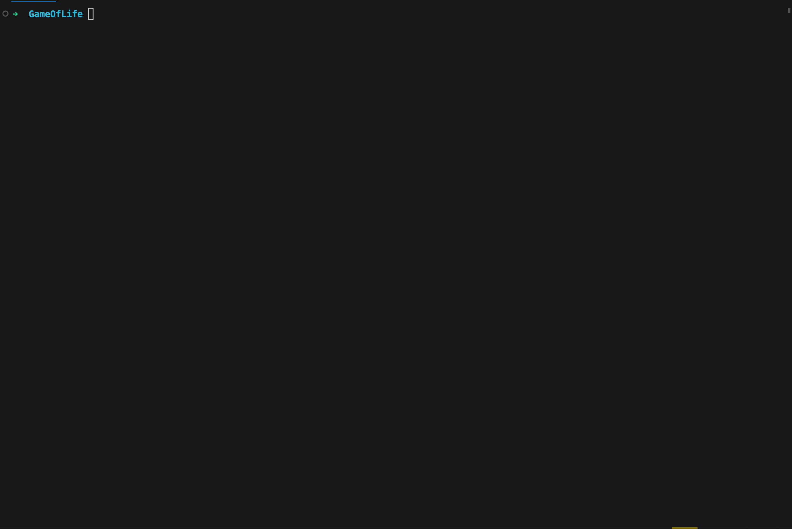

# Conway's Game of Life in C

 


This project implements Conway's Game of Life in C. The Game of Life is a cellular automaton that was devised by mathematician John Horton Conway in 1970. The game is played on a two-dimensional grid of cells, where each cell is either alive or dead. The game progresses in discrete steps, where the state of each cell in the grid is updated according to a set of rules.

## Rules of the Game

The rules of the Game of Life are as follows:

1. Any live cell with fewer than two live neighbors dies, as if by underpopulation.
2. Any live cell with two or three live neighbors lives on to the next generation.
3. Any live cell with more than three live neighbors dies, as if by overpopulation.
4. Any dead cell with exactly three live neighbors becomes a live cell, as if by reproduction.

## Building and Running the Project

To build and run the project, you will need to have GCC installed on your system. Here are the steps to build and run the project:

1. Clone the repository to your local machine:

```
git clone https://github.com/delco97/game-of-life.git
```


1. Build the project using GCC:

```bash
docker-compose run --rm program gcc -o ./build/main main.c
```

4. Run the project:

```bash
docker-compose run --rm program ./build/main
```

## Contributing

If you find a bug or have an idea for a new feature, feel free to open an issue or submit a pull request on GitHub. We welcome contributions from the community!

## License

This project is licensed under the MIT License. See the `LICENSE` file for more information.